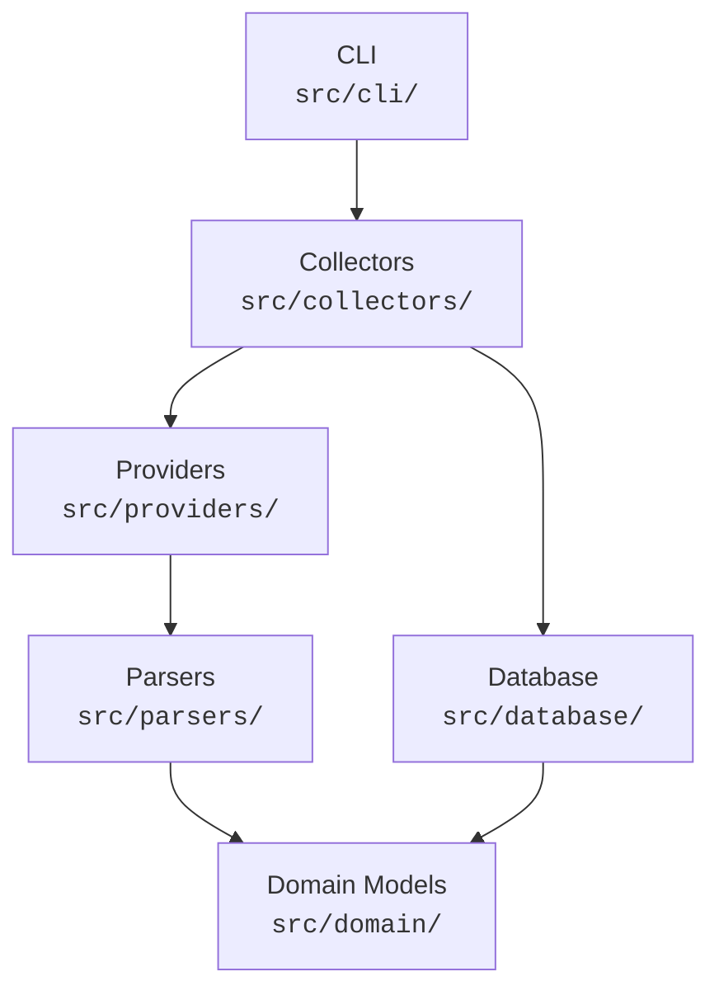

# Architecture

## Overview

TCG Market Intelligence is a data collection pipeline for trading card game
(TCG) price data, starting with Magic: The Gathering on the Brazilian
marketplace MYP Cards. The system discovers card sets and individual cards from
online sources, scrapes current and historical price data, parses the results
into domain objects, and persists them to a local SQLite database. It is
designed around a provider abstraction so that new data sources can be added
without modifying the core pipeline.

## Layer Diagram



Dependencies flow downward. The **Domain** layer is the foundation: it defines
pure dataclasses and abstract interfaces that all other layers depend on but
that depend on nothing else. The **Database** layer maps domain objects to
SQLAlchemy ORM models. **Parsers** produce domain objects from raw HTML/JSON.
**Providers** call parsers and implement the `CardSourceProvider` interface.
**Collectors** orchestrate providers and the repository. The **CLI** is the
user-facing entry point.

## Layers

### `src/cli/` -- Command-Line Interface

Entry point for all user-facing operations. Built with
[Click](https://click.palletsprojects.com/).

| Command        | Description                                      |
|----------------|--------------------------------------------------|
| `backfill`     | Full discovery + history collection for all (or filtered) cards |
| `update`       | Incremental fetch of recent data for already-known cards |
| `retry-failed` | Re-process cards that failed in previous runs    |

Each command accepts options for database URL, rate-limit delay, history
window, card limit, and dry-run mode. Commands delegate to async functions in
`src/collectors/`.

**Key file:** `src/cli/main.py`

### `src/collectors/` -- Orchestration

Contains the collection pipeline logic: card discovery, per-card processing,
error handling, and summary reporting. Three async entry points map 1:1 to the
CLI commands:

- `run_backfill()` -- discover sets/cards, fetch details and full history,
  persist everything.
- `run_update()` -- iterate over known `source_cards` rows and fetch recent
  history only.
- `run_retry_failed()` -- query unresolved errors, deduplicate, and re-run the
  full processing pipeline for each.

The collector is provider-aware (currently imports `MypCardsProvider` directly)
but keeps parsing and HTTP concerns out of its own code.

**Key file:** `src/collectors/backfill.py`

### `src/providers/` -- Data Source Clients

Each subdirectory under `src/providers/` implements a single data source.
Providers are async HTTP clients that implement the `CardSourceProvider` ABC
(defined in `src/domain/interfaces.py`).

**Current provider:** `src/providers/myp/provider.py` -- MYP Cards
(mypcards.com)

- Uses `curl_cffi` with `impersonate="chrome"` to bypass Cloudflare protection.
- Built-in rate limiting (configurable delay between requests).
- Exponential backoff on 429/403/5xx responses, up to a configurable retry
  count.
- Discovers sets via paginated `/magic/edicoes` pages, cards via
  `/magic/{set_slug}` pages, details via `/magic/produto/{id}/{slug}`, and
  history via `/magic/preco/{id}/{slug}?dias={N}`.

**Key file:** `src/providers/myp/provider.py`

### `src/parsers/` -- HTML / JSON-LD / JS Extraction

Pure functions that take raw HTML strings and return domain objects. No I/O.

| Function               | Input             | Output                     |
|------------------------|-------------------|----------------------------|
| `parse_set_links`      | Editions HTML     | `list[str]` (set slugs)    |
| `parse_card_links`     | Set page HTML     | `list[tuple[str, str]]` (id, slug) |
| `parse_card_page`      | Product page HTML | `SourceCard` with identity |
| `parse_price_snapshot` | Product page HTML | `PriceSnapshot`            |
| `parse_price_history`  | History page HTML | `list[HistoricalPrice]`    |
| `parse_pagination_max` | Any paginated HTML| `int` (max page number)    |

Card identity is extracted from JSON-LD `@type: Product` blocks. Historical
prices are parsed from the `window.precoChartConfig` JavaScript variable
embedded in history pages.

**Key file:** `src/parsers/myp.py`

### `src/domain/` -- Domain Models and Interfaces

Pure Python with no external dependencies beyond the standard library. Contains:

- **`models.py`** -- Dataclasses that represent the core domain:
  - `CardIdentity` -- game, names (EN/PT), set code, collector number
  - `SourceCard` -- a card as seen by a specific provider (source, external ID,
    URL, SKU, identity)
  - `PriceSnapshot` -- current price observation (min, avg, TCG, last sold)
  - `HistoricalPrice` -- single historical price data point (median, TCG, last
    sold, volume)
  - `CollectionError` -- record of a failed collection attempt
  - `CollectionSummary` -- aggregated stats for a collection run
  - Supporting enums: `Game`, `Condition`, `Finish`

- **`interfaces.py`** -- The `CardSourceProvider` ABC that all providers must
  implement:
  - `source_name` (property) -- unique identifier for this source
  - `discover_sets()` -- return available set identifiers
  - `discover_cards(set_id?)` -- return `SourceCard` objects
  - `get_current_price(card)` -- return a `PriceSnapshot`
  - `get_price_history(card, days?)` -- return `list[HistoricalPrice]`

**Key files:** `src/domain/models.py`, `src/domain/interfaces.py`

### `src/database/` -- Persistence

SQLAlchemy ORM models and a `Repository` class that encapsulates all database
operations. Uses SQLite by default.

**ORM models** (`src/database/models.py`):

| Table                | Purpose                              | Key Constraint                |
|----------------------|--------------------------------------|-------------------------------|
| `cards`              | Canonical card identity              | `UNIQUE(game, set_code, collector_number)` |
| `source_cards`       | Per-source card metadata             | `UNIQUE(source, external_id)` |
| `price_observations` | Historical price time series         | `UNIQUE(source, external_id, observed_at)` |
| `collection_errors`  | Failed collection attempts           | Indexed by `(resolved, source)` |

**Repository** (`src/database/repository.py`):

- `upsert_source_card()` / `upsert_card()` -- insert-or-update with
  idempotency guaranteed by unique constraints.
- `insert_price_observations()` -- bulk insert that skips existing rows
  (deduplication by source + external_id + date).
- `insert_error()` / `get_unresolved_errors()` / `mark_errors_resolved()` --
  error tracking and retry support.
- `get_all_source_cards()` -- used by `run_update()` to iterate known cards.

**Key files:** `src/database/models.py`, `src/database/repository.py`

## Data Flow

A full backfill follows these steps:

```
1. CLI parses arguments, calls run_backfill()
2. Collector creates MypCardsProvider + Repository
3. DISCOVER SETS
   Provider fetches /magic/edicoes (paginated)
   Parser extracts set slugs from <a> tags
4. DISCOVER CARDS (per set)
   Provider fetches /magic/{set_slug} (paginated)
   Parser extracts (card_id, slug) tuples from links
   Provider builds SourceCard objects
5. PROCESS EACH CARD
   a. Provider fetches /magic/produto/{id}/{slug}
      Parser extracts JSON-LD Product -> SourceCard with CardIdentity
      Repository upserts source_cards + cards rows
   b. Provider fetches /magic/preco/{id}/{slug}?dias=1095
      Parser extracts window.precoChartConfig -> list[HistoricalPrice]
      Repository inserts price_observations (skips duplicates)
   c. Repository marks any prior errors as resolved
6. Collector builds CollectionSummary, CLI prints report
```

Incremental updates (`run_update`) skip steps 3-4 and iterate over existing
`source_cards` rows, fetching only recent history (default 30 days).

## Extension Points

### Adding a New Data Source Provider

To add a new marketplace (e.g., Liga Magic, Card Kingdom):

1. **Create a parser** at `src/parsers/<source>.py` with pure functions that
   convert raw HTML/JSON into domain objects (`SourceCard`, `HistoricalPrice`,
   etc.).

2. **Create a provider** at `src/providers/<source>/provider.py` that
   implements the `CardSourceProvider` ABC from `src/domain/interfaces.py`:

   ```python
   from src.domain.interfaces import CardSourceProvider

   class MyNewProvider(CardSourceProvider):
       @property
       def source_name(self) -> str:
           return "my_source"

       async def discover_sets(self) -> list[str]: ...
       async def discover_cards(self, set_id=None) -> list[SourceCard]: ...
       async def get_current_price(self, card) -> PriceSnapshot | None: ...
       async def get_price_history(self, card, days=1095) -> list[HistoricalPrice]: ...
   ```

3. **Register the provider** in the collector (`src/collectors/backfill.py`)
   or create a new collector module. Currently the collector hard-codes
   `MypCardsProvider`; a future refactor may introduce a provider registry.

4. **No database changes needed** -- the existing schema supports multiple
   sources via the `source` column on `source_cards`, `price_observations`,
   and `collection_errors`.

## Key Design Decisions

Architecture decisions are recorded as ADRs under `docs/adr/`:

| ADR  | Title                                | Status   |
|------|--------------------------------------|----------|
| [0001](adr/0001-adopt-claude-didio-framework.md) | Adopt claude-didio-config framework | Accepted |

Future ADRs will cover the web/API stack (ADR-0002) and other significant
architectural choices as they arise.

## Diagrams

Mermaid diagram files are maintained under `docs/diagrams/`. These are living
documentation and are kept in sync with the codebase as features ship.

- [Diagrams README](diagrams/README.md) -- index of available diagrams
- [Diagram templates](diagrams/templates/) -- reusable Mermaid templates

Feature-specific diagrams (architecture and user journey) are added per feature
under `docs/diagrams/` as `<FXX>-architecture.mmd` and `<FXX>-journey.mmd`.
