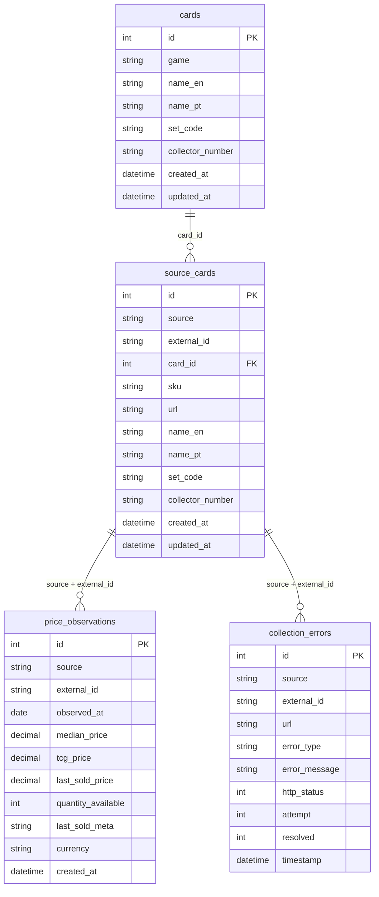

# Database

## Overview

TCG Market Intelligence uses **SQLite** as its database engine, accessed via
**SQLAlchemy** (ORM with mapped dataclasses). The database is stored as a
single file (`tcg_market.db` by default) and is initialized automatically
via `Base.metadata.create_all()` on first use.

- **ORM models:** `src/database/models.py`
- **Repository (queries/upserts):** `src/database/repository.py`
- **Default connection string:** `sqlite:///tcg_market.db`

---

## Schema Diagram

---

## Tables

### `cards` -- Canonical Card Identity

Stores the deduplicated, source-independent identity of each card. A card is
uniquely identified by `(game, set_code, collector_number)`.

| Column | Type | Nullable | Default | Description |
|--------|------|----------|---------|-------------|
| `id` | `Integer` | No | autoincrement | Primary key |
| `game` | `String(50)` | No | -- | Game identifier (e.g., `"magic"`) |
| `name_en` | `String(500)` | No | -- | English card name |
| `name_pt` | `String(500)` | Yes | `NULL` | Portuguese card name |
| `set_code` | `String(20)` | Yes | `NULL` | Set code (e.g., `"DMR"`, `"LTR"`) |
| `collector_number` | `String(20)` | Yes | `NULL` | Collector number within set |
| `created_at` | `DateTime` | No | `datetime.now` | Row creation timestamp |
| `updated_at` | `DateTime` | No | `datetime.now` | Last update timestamp (auto-updated) |

**Constraints:**
- `uq_card_identity`: `UNIQUE(game, set_code, collector_number)`

**Indexes:**
- `ix_card_game_set`: `(game, set_code)` -- fast lookup by game and set
- `ix_card_name_en`: `(name_en)` -- fast lookup by English name

---

### `source_cards` -- Per-Source Card Data

Links a card in a specific source (e.g., MYP Cards) to its canonical identity
in the `cards` table. Each source has its own external ID, SKU, and URL.

| Column | Type | Nullable | Default | Description |
|--------|------|----------|---------|-------------|
| `id` | `Integer` | No | autoincrement | Primary key |
| `source` | `String(50)` | No | -- | Source identifier (e.g., `"myp"`) |
| `external_id` | `String(100)` | No | -- | Source-specific card ID |
| `card_id` | `Integer` | Yes | `NULL` | FK to `cards.id` (logical, not enforced) |
| `sku` | `String(100)` | Yes | `NULL` | Source-specific SKU (e.g., `"magic_dmr_42"`) |
| `url` | `String(1000)` | No | -- | Full URL to the card page |
| `name_en` | `String(500)` | Yes | `NULL` | English name as reported by source |
| `name_pt` | `String(500)` | Yes | `NULL` | Portuguese name as reported by source |
| `set_code` | `String(20)` | Yes | `NULL` | Set code as parsed from source |
| `collector_number` | `String(20)` | Yes | `NULL` | Collector number as parsed from source |
| `created_at` | `DateTime` | No | `datetime.now` | Row creation timestamp |
| `updated_at` | `DateTime` | No | `datetime.now` | Last update timestamp (auto-updated) |

**Constraints:**
- `uq_source_card`: `UNIQUE(source, external_id)`

**Indexes:**
- `ix_source_card_sku`: `(sku)` -- fast lookup by SKU

**Note:** The `card_id` column is a logical foreign key to `cards.id`. It is
not enforced at the database level (no `ForeignKey` constraint in the model)
to allow inserting source cards before their canonical card row exists.

---

### `price_observations` -- Immutable Price Snapshots

Each row is an immutable record of price data for a card at a specific point
in time. This is the core analytical table. Rows are never updated -- only
inserted.

| Column | Type | Nullable | Default | Description |
|--------|------|----------|---------|-------------|
| `id` | `Integer` | No | autoincrement | Primary key |
| `source` | `String(50)` | No | -- | Source identifier |
| `external_id` | `String(100)` | No | -- | Source-specific card ID |
| `observed_at` | `Date` | No | -- | Date of the observation |
| `median_price` | `Numeric(12,2)` | Yes | `NULL` | Median market price (BRL) |
| `tcg_price` | `Numeric(12,2)` | Yes | `NULL` | TCG Player reference price (BRL) |
| `last_sold_price` | `Numeric(12,2)` | Yes | `NULL` | Last sold price (BRL) |
| `quantity_available` | `Integer` | Yes | `NULL` | Number of listings available |
| `last_sold_meta` | `String(200)` | Yes | `NULL` | Metadata about last sale (seller info) |
| `currency` | `String(3)` | No | `"BRL"` | Currency code |
| `created_at` | `DateTime` | No | `datetime.now` | Row creation timestamp |

**Constraints:**
- `uq_price_observation`: `UNIQUE(source, external_id, observed_at)`

**Indexes:**
- `ix_price_obs_card_date`: `(source, external_id, observed_at)` -- fast
  time-series queries for a specific card

---

### `collection_errors` -- Failed Collection Attempts

Records failed scraping attempts for debugging and retry logic. Errors can be
marked as resolved after a successful retry.

| Column | Type | Nullable | Default | Description |
|--------|------|----------|---------|-------------|
| `id` | `Integer` | No | autoincrement | Primary key |
| `source` | `String(50)` | No | -- | Source identifier |
| `external_id` | `String(100)` | Yes | `NULL` | Source-specific card ID (if known) |
| `url` | `String(1000)` | No | -- | URL that failed |
| `error_type` | `String(100)` | No | -- | Error classification (e.g., `"HTTPError"`) |
| `error_message` | `Text` | No | -- | Full error message |
| `http_status` | `Integer` | Yes | `NULL` | HTTP status code (if applicable) |
| `attempt` | `Integer` | No | `1` | Attempt number when error occurred |
| `resolved` | `Integer` | No | `0` | Resolution flag (`0` = unresolved, `1` = resolved) |
| `timestamp` | `DateTime` | No | `datetime.now` | When the error occurred |

**Indexes:**
- `ix_error_unresolved`: `(resolved, source)` -- fast lookup of unresolved
  errors, optionally filtered by source

---

## Idempotency Strategy

The system is designed for safe re-runs. Running the same backfill twice
produces zero duplicate data.

### Price Observations (Append-Only)

Price observations are **immutable** -- they are inserted but never updated.
Idempotency is guaranteed by:

1. **Unique constraint:** `UNIQUE(source, external_id, observed_at)` prevents
   duplicate observations at the database level.
2. **Check-before-insert:** The repository's `insert_price_observations()`
   method queries for an existing row with the same `(source, external_id,
   observed_at)` tuple before inserting. If a match is found, the row is
   skipped silently.
3. **Batch commit:** All observations for a single card are inserted in one
   transaction. If any error occurs, the entire batch rolls back.

### Cards and Source Cards (Upsert)

Cards (`cards` table) and source cards (`source_cards` table) use an
**upsert** pattern:

1. **Query by unique key:** Look up existing row by `(game, set_code,
   collector_number)` for cards or `(source, external_id)` for source cards.
2. **If exists:** Update mutable fields (names, SKU, URL) with new values,
   but only if the new value is non-null (preserving previously collected
   data).
3. **If not exists:** Insert a new row.

This ensures that re-running discovery enriches data (fills in missing names,
updates URLs) without creating duplicates.

### Error Resolution

When a card that previously failed is successfully collected, its unresolved
errors are marked as `resolved = 1` via `mark_errors_resolved()`. This keeps
the error history for auditing while cleaning up the retry queue.

---

## Indexes

| Index Name | Table | Columns | Rationale |
|-----------|-------|---------|-----------|
| `ix_card_game_set` | `cards` | `(game, set_code)` | Filter cards by game and set |
| `ix_card_name_en` | `cards` | `(name_en)` | Search cards by English name |
| `ix_source_card_sku` | `source_cards` | `(sku)` | Look up source cards by SKU |
| `ix_price_obs_card_date` | `price_observations` | `(source, external_id, observed_at)` | Time-series queries for a card's price history |
| `ix_error_unresolved` | `collection_errors` | `(resolved, source)` | Find unresolved errors for retry |

All unique constraints also implicitly create indexes in SQLite.

---

## Migration Strategy

**Current approach:** The schema is managed via `Base.metadata.create_all()`,
which creates tables that do not yet exist but does **not** alter existing
tables. This is sufficient for the MVP phase.

**Future plan:** Adopt [Alembic](https://alembic.sqlalchemy.org/) for
schema migrations when the schema stabilizes and production data needs to
be preserved across schema changes. Key triggers for migration adoption:

- Adding new columns to existing tables
- Changing column types or constraints
- Renaming tables or columns
- Adding foreign key enforcement

Until Alembic is adopted, schema changes require either manual `ALTER TABLE`
statements or recreating the database (acceptable during early development).

---

## See Also

- [DATA_SOURCES.md](DATA_SOURCES.md) -- how data is collected from each source
- `src/database/models.py` -- SQLAlchemy model definitions (source of truth)
- `src/database/repository.py` -- query and upsert logic
