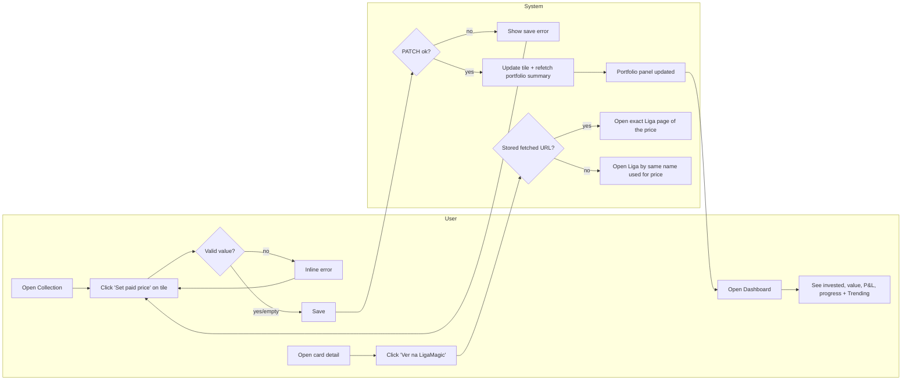

# F124-T10: README + diagrams + full regression

- **Wave:** 3
- **Type:** docs / test
- **Depends on:** F124-T01, F124-T02, F124-T03, F124-T04, F124-T05, F124-T06, F124-T07, F124-T08, F124-T09
- **Status:** done
- **Maps to AC:** AC6, AC7

## User Story

As a maintainer, I want F124's behaviour documented and fully regression
tested, so that the valuation panel and Liga link fix stay correct.

## Objective

Create the 2 mandatory diagrams, update README, run the whole test/build/lint suite and fix any residual breakage.

## Dev Notes

Veja `_brief/00-overview.md`, `_brief/01-paid-price.md`, `_brief/02-dashboard.md` e `_brief/03-liga-link.md`.

- Diagram templates: `docs/diagrams/templates/architecture.mmd`, `docs/diagrams/templates/user-journey.mmd`; examples `docs/diagrams/F85-*.mmd`. Index: `docs/diagrams/README.md` (add F124 entries if the index lists features).
- README: feature notes under the features section (pattern `### F94 -- Collection Persistence (Litestream + R2) (2026-08-31)` around L857); add `### F124 -- Collection Valuation Panel & Liga Link Fix (2026-09-13)` before `## Deployment`.
- Docs index `docs/README.md`: link PRD `docs/prd/F124-collection-valuation-panel.md` and ADR `docs/adr/0012-liga-fetched-url-persistence.md` if the index lists PRDs/ADRs.
- Verify cross-links resolve (architect learning F02).

## Implementation details

1. `docs/diagrams/F124-architecture.mmd` (start from stub, adjust to real code):
```mermaid
flowchart LR
  subgraph FE[Frontend React]
    DASH[Dashboard.tsx] --> DIS[DashboardInvestmentSummary]
    DASH --> TREND[TrendingSection]
    MYC[MyCollection.tsx] --> PPQ[PaidPriceQuickEdit]
    MYC --> PD[PortfolioDashboard]
    CCD[CollectionCardDetail.tsx] --> API_IN[AcquisitionPriceInput]
    CD[CardDetail.tsx]
  end
  subgraph API[FastAPI]
    LIST[GET /collection]
    PATCH[PATCH /collection/:id]
    PS[GET /collection/portfolio-summary]
    DET[GET /collection/:id]
    RL[POST /collection/:id/refresh-liga]
    CARD[GET /cards/:id]
  end
  subgraph LIGA[Liga pipeline]
    SWEEP[liga_sweep / scan / CLI] --> PROV[LigaMagicProvider.search_card]
    RL --> PROV
    PROV -->|page.url| URLS[urls.py validate]
    URLS --> REC[liga_url_recorder]
  end
  subgraph DB[(Neon PostgreSQL / SQLite)]
    UC[user_collection.acquisition_price]
    PO[price_observations liga_id / liga_id_foil]
    LCU[liga_card_urls]
  end
  PPQ --> PATCH --> UC
  API_IN --> PATCH
  DIS --> PS
  PD --> PS
  PS --> UC
  PS --> PO
  LIST --> UC
  PROV --> PO
  REC --> LCU
  DET -->|ligamagic_url| LCU
  CARD -->|ligamagic_url| LCU
  CCD --> DET
  CD --> CARD
```
2. `docs/diagrams/F124-journey.mmd`:

3. README section: what shipped — grid paid-price quick edit; list/detail return paid price; P&L semantics (priced-only, foil-aware, `unpriced_card_count`); dashboard slimmed (market strip removed, Trending kept, investment block added); Liga link = fetched URL (`liga_card_urls` table, ADR 0012), fallback + "URLs fill in on next sweep (≤ max_age_days)".
4. Regression: run all commands below; fix residual failures caused by F124 (do not weaken assertions or skip tests).

## Acceptance criteria

- [ ] Both `.mmd` files exist and match the implemented code (names of files/components/endpoints verified with grep).
- [ ] README has the F124 section.
- [ ] `pytest tests/ --cov=src --cov-report=term-missing` green; new modules (`src/providers/liga/urls.py`, `src/collectors/liga_url_recorder.py`) ≥ 90% coverage.
- [ ] `cd frontend && npm test` green; `cd frontend && npm run build` green; `ruff check src/` clean.
- [ ] All markdown links added by F124 (README, PRD, ADR, task README) resolve.

## Testing

- Framework: pytest (backend, with coverage) + Vitest/React Testing Library (frontend), plus `npm run build` (tsc typecheck) and `ruff` for lint.
- Scope: full regression across every F124-touched module; fix only F124-caused breakage without weakening assertions or skipping tests; new modules (`src/providers/liga/urls.py`, `src/collectors/liga_url_recorder.py`) must reach ≥90% coverage.
- Commands: `pytest tests/ --cov=src --cov-report=term-missing`, `cd frontend && npm test`, `cd frontend && npm run build`, `ruff check src/`.

## Test scenarios

- Full suites green (happy).
- Grep checks (edge): `grep -rn "fetchMarketStats" frontend/src/pages/Dashboard.tsx` → empty; `grep -rn "market-summary-strip" frontend/src` → only absent / tests asserting absence.
- Error handling: confirm recorder failure test and invalid stored URL test exist (from T06/T07); add if missing.
- Boundary: `is_valid_liga_card_url` 1000/1001-char tests exist (T01); add if missing.

## Diagrams

- **Owner** of `docs/diagrams/F124-architecture.mmd` and `docs/diagrams/F124-journey.mmd` (stubs above).

## Notes from Developer

- Diagrams adjusted from the stub: `DashboardInvestmentSummary` and
  `PortfolioDashboard` each call `GET /collection/portfolio-summary`
  directly (not routed through `Dashboard.tsx`); `Dashboard.tsx` keeps
  its own `GET /collection/summary` call for the coverage KPIs. Verified
  against the real component/router code with grep before drawing.
- `docs/diagrams/README.md` and `docs/README.md` only link to the
  `diagrams/`, `prd/`, `adr/` directories (no per-feature index to
  update), so no edits were needed there.
- Full regression triage: ran `pytest tests/ --cov=src` on this branch
  (67 failed / 3369 passed) and again against the unmodified baseline
  via `git stash` (80 failed / 3338 passed, with F124's new untracked
  test/src files still present, since `git stash` does not stash
  untracked files). Diffing the two failure sets showed only one
  failure unique to this branch:
  `tests/collectors/test_liga_sweep.py::test_provider_error_does_not_record_url`,
  which referenced an undefined `mock_sleep` left over from a
  copy-pasted assertion block (the test uses a single card with
  `delay=0` and never patches `asyncio.sleep`). Removed the dangling
  assertion to match the pattern of the neighboring
  `test_no_price_found_does_not_record_url` test — fixed, not weakened
  (the `errors == 1` / `upsert_liga_card_url.assert_not_called()`
  assertions are untouched).
- The remaining ~66 failures (marketplace, decks, currency,
  liga_coverage, repository_api, sync_collection, error_codes,
  seed_users, provider_windows, cards_router history) reproduce
  identically on the unmodified baseline and are unrelated to any
  F124-touched file — left untouched per scope (no unrelated refactor).
  Several share a pattern of `FOREIGN KEY constraint failed` on
  `user_id=1` in fresh per-test sqlite DBs, suggesting a missing seed
  fixture independent of this feature; worth a dedicated bug ticket.
  `test_fetch_liga_price_prefers_low_over_mid` is also pre-existing and
  additionally contradicts the documented guardrail in `CLAUDE.md`
  ("Liga sweep usa preco `mid`, NAO `low`"), so its assertion is stale
  rather than something to "fix" here.
- New modules coverage: `src/collectors/liga_url_recorder.py` 100%,
  `src/providers/liga/urls.py` 91% (both ≥90% AC).
- Frontend: `npm test` 201 files / 1958 tests passed; one
  `window.scrollTo`-related jsdom unhandled-rejection warning in
  `MyCollectionSort.test.tsx` is pre-existing jsdom noise (reproduces
  on baseline), not an assertion failure. `npm run build` and
  `ruff check src/` both clean.
