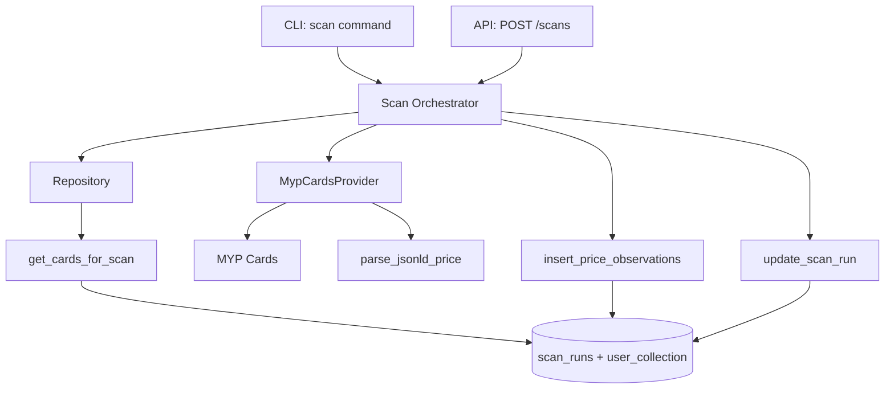

# F13-T04: Scan Orchestrator

- **Wave:** 2
- **Type:** backend
- **Depends on:** F13-T03
- **Status:** planned

## User Story

As a system operator, I want a unified scan orchestrator that accepts
filters and tracks execution metrics, so that I can run targeted scans
and audit their results.

## Objective

Create `src/collectors/scan.py` with a `run_scan()` async function that
orchestrates filtered price collection with full metric tracking.

## Dev Notes

Veja `_brief/00-overview.md` e `_brief/03-scan-orchestrator.md`.

Existing pattern to follow: `src/collectors/snapshot_prices.py`
- Uses `asyncio.Semaphore` for concurrency control
- Uses `asyncio.Lock` for thread-safe summary updates
- Calls `provider.fetch_current_price(external_id, slug)`
- Stores observations via `repo.insert_price_observations()`
- Uses `structlog` for logging

Key differences from `snapshot_prices.py`:
1. Creates a `scan_runs` DB row at start (via `repo.create_scan_run()`)
2. Gets card list from `repo.get_cards_for_scan(filter)` instead of
   `repo.get_linked_collection_with_source()`
3. Updates `scan_runs` row with counts throughout and at end
4. Returns a `ScanRun` domain object instead of `SnapshotSummary`
5. Status logic: `completed` if <= 50% errors, `failed` otherwise

Do NOT copy-paste `snapshot_prices.py`. Instead, import and reuse
`MypCardsProvider` and the same observation-creation pattern.

## Implementation Details

New file: `src/collectors/scan.py`

```python
async def run_scan(
    db_url: str = "sqlite:///tcg_market.db",
    scan_filter: ScanFilter | None = None,
    dry_run: bool = False,
    delay: float = 1.0,
    concurrency: int = 3,
) -> ScanRun:
```

Internal flow:
1. `scan_filter = scan_filter or ScanFilter()`
2. `run_id = repo.create_scan_run(scan_filter.scan_type.value, scan_filter.to_json())`
3. `repo.update_scan_run(run_id, status="running", started_at=datetime.now())`
4. `entries = repo.get_cards_for_scan(scan_filter)`
5. `repo.update_scan_run(run_id, cards_total=len(entries))`
6. Process entries with semaphore (same as snapshot_prices)
7. On each success: increment `cards_processed`, `observations_saved`
8. On each error: increment `cards_failed`
9. Final: set `status`, `finished_at`, `error_summary`
10. Return `ScanRun` populated from DB row

## Acceptance Criteria

- [ ] `run_scan()` creates a `scan_runs` row with status=running
- [ ] Scan respects `ScanFilter` (set_codes, collection_only, limit)
- [ ] Per-card errors do not abort the scan
- [ ] Scan run row is updated with final status and counts
- [ ] Idempotency: skips cards with existing snapshot for today
- [ ] Returns populated `ScanRun` dataclass
- [ ] All existing tests pass

## Testing

Framework: pytest (`python -m pytest tests/`)
Test file: `tests/unit/collectors/test_scan.py`

## Test Scenarios

1. **Happy path:** Mock provider returns prices, verify ScanRun has correct counts
2. **Dry run:** No DB writes, but ScanRun still populated with counts
3. **Filter by set:** Only cards matching set_code are processed
4. **Idempotency:** Cards with existing snapshot for today are skipped
5. **Error handling:** Provider raises on one card, scan continues, cards_failed=1
6. **Failed status:** When > 50% cards fail, status is "failed"
7. **Empty filter result:** No cards match filter, scan completes with cards_total=0
8. **Scan run persistence:** Verify scan_runs row has correct started_at and finished_at

## Diagrams

Owner of `docs/diagrams/F13-architecture.mmd`.

Stub:

