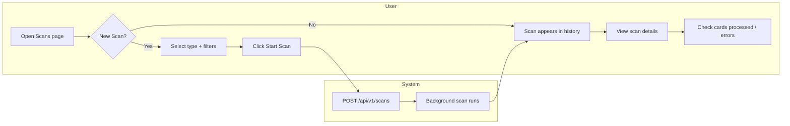

# F13-T08: Frontend Scans Page

- **Wave:** 4
- **Type:** frontend
- **Depends on:** F13-T07
- **Status:** planned

## User Story

As a collector, I want a Scans page where I can trigger price scans with
filters and view past scan history, so that I can manage data collection
visually.

## Objective

Create the Scans page with a scan trigger form, history table, and
navigation integration.

## Dev Notes

Veja `_brief/00-overview.md` e `_brief/05-frontend.md`.

Existing patterns in `frontend/src/`:
- Pages in `pages/` directory, exported and routed in `App.tsx`
- API calls via `api.ts` utility (fetch wrapper)
- Hooks in `hooks/` directory for data fetching
- Tailwind CSS for styling
- Components in `components/` directory
- Navigation in sidebar/nav component

Key files to reference for patterns:
- `frontend/src/pages/MyCollection.tsx` -- table layout pattern
- `frontend/src/pages/Dashboard.tsx` -- card/stat layout pattern
- `frontend/src/hooks/useCollection.ts` -- API hook pattern
- `frontend/src/lib/api.ts` -- fetch utility

## Implementation Details

New files:
1. `frontend/src/hooks/useScans.ts` -- API hooks
2. `frontend/src/components/ScanForm.tsx` -- trigger form
3. `frontend/src/components/ScanHistoryTable.tsx` -- history table
4. `frontend/src/pages/Scans.tsx` -- page component

Update files:
1. `frontend/src/App.tsx` -- add route
2. Navigation component -- add "Scans" link

### useScans.ts

```typescript
export function useScans(params?) { /* GET /api/v1/scans */ }
export function useScanDetail(id) { /* GET /api/v1/scans/{id} */ }
export function useTriggerScan() { /* POST /api/v1/scans */ }
```

### ScanForm.tsx

- Scan type dropdown (Collection, By Set, By Format, Custom)
- Conditional inputs: set code text input, format dropdown, card IDs textarea
- Limit input (optional number)
- Start Scan button -> calls `useTriggerScan()`
- On success: shows scan_id, refreshes history

### ScanHistoryTable.tsx

- Table columns: ID, Type, Status, Cards, Processed, Failed, Obs, Started, Duration
- Status badges with colors: pending=gray, running=blue, completed=green, failed=red
- Clickable rows (emit onSelect)
- Empty state message

### Scans.tsx

- Header with title + "New Scan" toggle button
- Collapsible ScanForm
- ScanHistoryTable
- Optional: detail panel on row click

## Acceptance Criteria

- [ ] Scans page accessible at `/scans`
- [ ] Navigation includes "Scans" link
- [ ] Scan form allows selecting type and entering filters
- [ ] Triggering a scan calls POST API and shows confirmation
- [ ] Scan history table displays past runs with correct status badges
- [ ] Table refreshes after triggering a scan
- [ ] All existing frontend tests pass

## Testing

Framework: Vitest + React Testing Library (`cd frontend && npm test`)
Test files:
- `frontend/src/hooks/__tests__/useScans.test.ts`
- `frontend/src/components/__tests__/ScanForm.test.tsx`
- `frontend/src/components/__tests__/ScanHistoryTable.test.tsx`
- `frontend/src/pages/__tests__/Scans.test.tsx`

## Test Scenarios

1. **useScans hook:** Mock fetch, verify data shape returned
2. **useTriggerScan hook:** Mock fetch POST, verify request body
3. **ScanForm render:** All form elements present
4. **ScanForm type change:** Selecting "By Set" shows set code input
5. **ScanForm submit:** Fill form, click Start, verify API called
6. **ScanHistoryTable render:** Pass scan data, verify rows rendered
7. **ScanHistoryTable status badges:** Completed=green, failed=red
8. **ScanHistoryTable empty state:** No data shows empty message
9. **Scans page render:** Form and table both rendered
10. **Scans page toggle:** New Scan button toggles form visibility

## Diagrams

Owner of `docs/diagrams/F13-journey.mmd`.

Stub:

