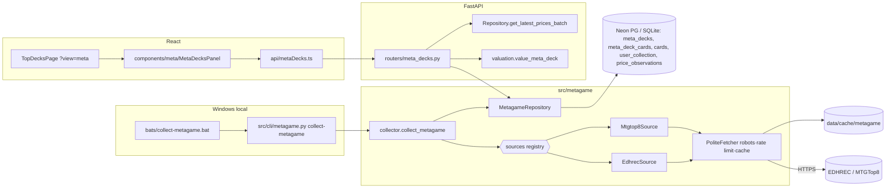

# F173-T14 — Diagramas F173 (arquitetura + jornada)

- **Wave:** 3
- **Type:** docs
- **Depends on:** F173-T01, F173-T09, F173-T10, F173-T11
- **Status:** done
- **Maps to AC:** AC7

## User Story
As a future maintainer, I want architecture and user-journey diagrams for the metagame
feature, so that the data flow and UX are documented as living docs.

## Objective
Criar `docs/diagrams/F173-architecture.mmd` e `docs/diagrams/F173-journey.mmd`.

## Dev Notes
Veja `_brief/00-overview.md`, `_brief/01-sources-and-collection.md`, `_brief/03-valuation-api.md`
e `_brief/04-frontend.md`.
- Templates: `docs/diagrams/templates/architecture.mmd`, `docs/diagrams/templates/user-journey.mmd`;
  exemplo: `docs/diagrams/F85-*.mmd`.
- Usar nomes reais das fontes escolhidas no ADR e dos arquivos implementados (confira
  `ls src/metagame src/metagame/sources`). Link do ADR: `docs/adr/0016-metagame-deck-sources.md`
  (número reservado).

## Implementation details
Stub de arquitetura (ajustar aos nomes finais):

Jornada: `flowchart LR` com swimlanes Usuário / SPA / API / Coleta semanal: abrir Top Decks →
aba Mercado → escolher formato → (sem snapshot? → EmptyState) → lista com valor BRL →
(logado? owned % : CTA login) → expandir deck → ver cartas faltantes → abrir carta / fonte
externa; caminho de erro (API erro → ErrorBanner → retry).

## Acceptance criteria
- [ ] Dois arquivos `.mmd` válidos (renderizam em mermaid.live / `npx @mermaid-js/mermaid-cli` se disponível — não instalar).
- [ ] Nomes batem com o código entregue.

## Testing
- Docs — validar sintaxe Mermaid visualmente (mermaid.live; não instalar CLI).
- Checar nomes com `grep`: ex. `grep -n "class \|def collect_metagame" src/metagame -r` vs nós do diagrama.
- Sem código novo; regressão: `pytest tests/unit/metagame -q` e `ruff check src/` verdes.

## Test scenarios
- Happy path desenhado; decisão "tem snapshot?"; decisão "logado?"; caminho de erro da API;
  coleta com robots desautorizado (fonte pulada) no diagrama de arquitetura (nota).

## Diagrams
Owner de `F173-architecture.mmd` e `F173-journey.mmd`.

**Test plan:** ver `F173-test-plan.md` (fixtures: none)

## Notes from Developer
- Names checked against the code: `collect_metagame`, `EdhrecSource`, `Mtgtop8Source`, `PoliteFetcher`,
  `RobotsDisallowed`, `MetagameRepository`, `value_meta_deck`, `get_latest_prices_batch`,
  `MetaDecksPanel`/`MetaFormatPills`/`MetaDeckRow`/`MetaDeckCardList`, and `fetchMetaFormats`/`fetchMetaDecks`/`fetchMetaDeck`.
  `src/cli/metagame.py` + `bats/collect-metagame.bat` come from T12 (in parallel); the paths follow T12's spec.
- There was no Mermaid CLI to run (the task says not to install one), so the syntax was only checked by reading it.
- Regression: `ruff check src/` passes. `pytest tests/unit/metagame`: 217 passed, 1 failed (`test_http.py::test_registry_empty`).
  That test expects an empty registry, and T12 (in parallel) has already populated `src/metagame/sources/__init__.py`, so T12 should update the test.
