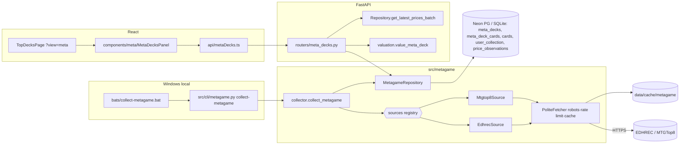

# F173-T14 — Diagramas F173 (arquitetura + jornada)

- **Wave:** 3
- **Type:** docs
- **Depends on:** F173-T01, F173-T09, F173-T10, F173-T11
- **Status:** planned

## User Story
As a future maintainer, I want architecture and user-journey diagrams for the metagame
feature, so that the data flow and UX are documented as living docs.

## Objective
Criar `docs/diagrams/F173-architecture.mmd` e `docs/diagrams/F173-journey.mmd`.

## Dev Notes
Veja `_brief/00-overview.md`, `_brief/01-sources-and-collection.md`, `_brief/03-valuation-api.md`
e `_brief/04-frontend.md`.
- Templates: `docs/diagrams/templates/architecture.mmd`, `docs/diagrams/templates/user-journey.mmd`;
  exemplo: `docs/diagrams/F85-*.mmd`.
- Usar nomes reais das fontes escolhidas no ADR e dos arquivos implementados (confira
  `ls src/metagame src/metagame/sources`). Revalidar número/link do ADR (pode ter mudado
  por colisão com outra feature do lote).

## Implementation details
Stub de arquitetura (ajustar aos nomes finais):

Jornada: `flowchart LR` com swimlanes Usuário / SPA / API / Coleta semanal: abrir Top Decks →
aba Mercado → escolher formato → (sem snapshot? → EmptyState) → lista com valor BRL →
(logado? owned % : CTA login) → expandir deck → ver cartas faltantes → abrir carta / fonte
externa; caminho de erro (API erro → ErrorBanner → retry).

## Acceptance criteria
- [ ] Dois arquivos `.mmd` válidos (renderizam em mermaid.live / `npx @mermaid-js/mermaid-cli` se disponível — não instalar).
- [ ] Nomes batem com o código entregue.

## Testing
Docs — validar sintaxe visualmente; checar nomes com `grep`.

## Test scenarios
- Happy path desenhado; decisão "tem snapshot?"; decisão "logado?"; caminho de erro da API;
  coleta com robots desautorizado (fonte pulada) no diagrama de arquitetura (nota).

## Diagrams
Owner de `F173-architecture.mmd` e `F173-journey.mmd`.
