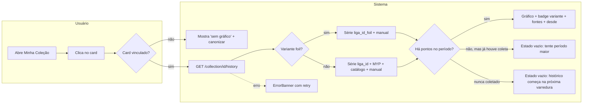

# F176-T02 — ADR de causa raiz + diagramas F176

**Wave:** 1
**Type:** docs
**Depends on:** F176-T01
**Status:** planned

## User Story
As a desenvolvedor futuro do projeto, I want a causa raiz e o contrato de chaves de histórico registrados num ADR, so that ninguém reintroduza o desalinhamento `liga_{card_id}` × `source_cards` numa quinta tentativa.

## Objective
Escrever o ADR com a causa raiz (baseado em `diagnosis.md`) e o contrato de resolução de chaves por variante; criar os diagramas de arquitetura e jornada da F176.

## Dev Notes
Veja `_brief/00-overview.md`, `_brief/01-diagnosis.md`, `_brief/02-key-resolution.md` e `_brief/03-snapshot-backfill.md`.

- Ler `tasks/features/F176-collection-price-history/diagnosis.md` (saída da T01). Se o diagnóstico **refutar** alguma hipótese ou ajustar o contrato do shard 02, o ADR prevalece — registre o ajuste em "Consequences" e adicione nota no topo de `_brief/02-key-resolution.md` ("ajustado pelo ADR 00XX").
- Numeração: `ls docs/adr` imediatamente antes de escrever; usar o próximo número livre (esperado `0014`). Outras features do lote podem criar ADRs em paralelo — se `0014` já existir, usar o seguinte e atualizar o link no `F176-README.md`.
- Formato: seguir `docs/adr/0012-liga-fetched-url-persistence.md` (Status, Context, Decision, Consequences).
- Templates: `docs/diagrams/templates/architecture.mmd` e `docs/diagrams/templates/user-journey.mmd`.
- Incluir no ADR a limpeza **opcional** dos `daily_snapshot` planos criados pelo backfill antigo, como SQL de exemplo comentado, marcada "executar só com aval do usuário" (CLAUDE.md: nunca `DELETE` sem confirmação).

### Stub — `docs/diagrams/F176-architecture.mmd`
```mermaid
flowchart LR
  subgraph Coleta
    LS[liga_sweep.py<br/>liga_{card_id}[_foil]] -->|fim do sweep| DS[price_snapshot.run_daily_snapshot]
    BAT[bats/daily-snapshot.bat] --> DS
    MYP[snapshot_prices.py<br/>jsonld_snapshot] --> PO
    MAN[manual_{card_id}] --> PO
    LS --> PO[(price_observations)]
    DS -->|daily_snapshot carry-forward ≤30d| PO
    BF[backfill-snapshots<br/>forward-fill] --> PO
  end
  subgraph Leitura
    KEYS[price_history_keys.resolve_history_keys<br/>variante foil/normal] --> SVC[collection_price_history.build_history]
    SC[(source_cards)] --> KEYS
    PO --> SVC
    SVC --> MERGE[merge_series_by_priority<br/>1 ponto/dia]
    MERGE --> H[/collection/{id}/history/]
    MERGE --> M[/collection/{id}/metrics/]
    MERGE --> CH[/cards/{id}/history/]
  end
  H --> UI[PriceChart + PriceHistoryMeta]
```

### Stub — `docs/diagrams/F176-journey.mmd`


## Implementation details
- `docs/adr/0017-collection-price-history-keys.md` (novo): Context (F33/F34/F112/F168, H1–H6 com números do diagnóstico), Decision (contrato de chaves, prioridade, carry-forward 30d, backfill forward-fill, snapshot pós-sweep, sem migração), Consequences (dados antigos, MYP foil, follow-up `get_price_series_batch`/sparkline se aplicável).
- `docs/diagrams/F176-architecture.mmd`, `docs/diagrams/F176-journey.mmd` (novos, a partir dos stubs).

## Acceptance criteria
- [ ] ADR cita os números do `diagnosis.md` para cada hipótese confirmada.
- [ ] ADR contém a tabela de chaves por variante e a ordem de prioridade.
- [ ] SQL de limpeza apenas como sugestão, explicitamente não executada.
- [ ] Dois `.mmd` válidos (renderizam no Mermaid live editor / sem erro de sintaxe).
- [ ] `F176-README.md` aponta para o número de ADR efetivamente usado.

## Testing
Docs-only. Validar sintaxe Mermaid: se `npx @mermaid-js/mermaid-cli` não estiver instalado, **não instalar** (sem deps novas) — revisar manualmente contra os templates.

## Test scenarios
- Happy: ADR e diagramas criados e linkados.
- Edge: número 0014 ocupado → próximo livre usado e links corrigidos.
- Edge: diagnóstico refuta H4 (foil) → ADR e shard 02 atualizados coerentemente.
- Error: `diagnosis.md` ausente → parar e reportar (T01 não concluída).

## Diagrams
Owner de `docs/diagrams/F176-architecture.mmd` e `docs/diagrams/F176-journey.mmd`.
