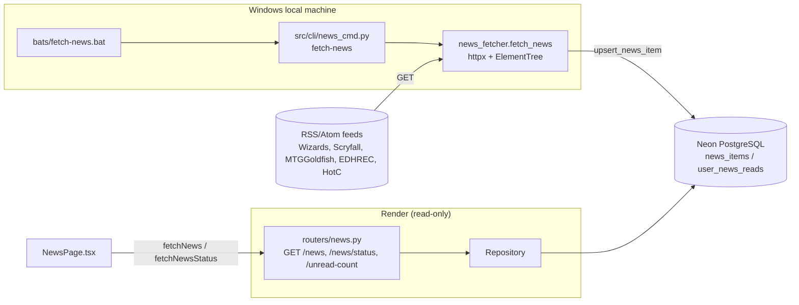

# F178-T06 — Architecture and journey diagrams

- **Wave:** 1
- **Type:** docs
- **Depends on:** F178-T01
- **Status:** planned
- **Maps to AC:** AC9

## User Story
As a maintainer, I want diagrams of the offline news-collection flow, so that I know news is collected locally and that the API only reads it.

## Objective
Create `docs/diagrams/F178-architecture.mmd` and `docs/diagrams/F178-journey.mmd`.

## Dev Notes
Veja `_brief/00-overview.md`, `_brief/02-fetcher.md`, `_brief/03-status-endpoint.md`, `_brief/04-cli-bat.md` e `_brief/05-frontend.md`.
Templates: `docs/diagrams/templates/architecture.mmd`, `docs/diagrams/templates/user-journey.mmd`. Examples: `docs/diagrams/F168-*.mmd`.

## Implementation details
Architecture stub:

Journey: two swimlanes — **Owner (local)**: run `.bat` → sources ok? (all fail → `[FAIL]`, check `--check-sources`) → items stored. **Reader (web)**: open /news → loading → error? (banner + retry) → total 0? (no-data state) → unread empty? (all-read → show all) → grid → click → opens source + mark read; stale hint if >72 h.

## Acceptance criteria
- [ ] Both files exist and render (valid Mermaid — check with `npx -y @mermaid-js/mermaid-cli` only if already available; otherwise careful syntax review).
- [ ] Journey includes decision points and error paths listed above.

## Testing
- Docs only: syntax review of both Mermaid files; no pytest/vitest.
- Ensure no `"` inside node labels without quoting, balanced `subgraph`/`end`, valid first-line diagram type.
- Check both files exist: `ls docs/diagrams/F178-architecture.mmd docs/diagrams/F178-journey.mmd`.

## Test scenarios
- Happy path drawn end-to-end.
- Error paths: all feeds fail; API error; empty DB.
- Edge: all read; stale data.

**Test plan:** ver `F178-test-plan.md` (fixtures: none — manual Mermaid syntax review)

## Diagrams
Owner of `F178-architecture.mmd` and `F178-journey.mmd`.
