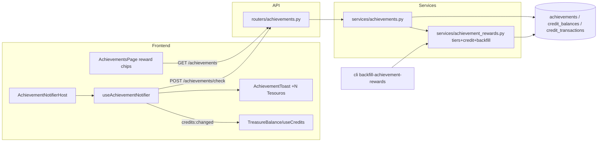

# F179-T01 — PRD, ADR and diagrams

**Wave:** 0
**Type:** docs
**Depends on:** —
**Status:** planned
- **Maps to AC:** AC10

## User Story

As a maintainer, I want the PRD, ADR and diagrams for achievement rewards,
so that the tier economy and idempotency decision are documented before code lands.

## Objective

Write the PRD, the ADR (ledger-based idempotency without a schema change) and
the two mandatory Mermaid diagrams.

## Dev Notes

Veja `_brief/00-overview.md`, `_brief/01-reward-model.md` e `_brief/03-backfill.md`.

- PRD template: `docs/prd/template.md`; recent example `docs/prd/F17-set-symbol-icons.md`.
- ADR style: `docs/adr/0013-guest-user-role-system.md`. ADR number is
  **0020** (reserved for F179 in `tasks/features/EXECUTION-PLAN-F171-F179.md`):
  write `docs/adr/0020-achievement-reward-ledger-idempotency.md`.
- Diagram templates: `docs/diagrams/templates/{architecture.mmd,user-journey.mmd}`;
  example `docs/diagrams/F168-*.mmd`.

## Implementation details

1. `docs/prd/F179-achievement-treasure-rewards.md`: problem, goals, tier
   table + mapping (copy from `_brief/01`), non-goals, AC list (README §Global AC), metrics
   (total Tesouros granted via `achievement_reward`).
2. `docs/adr/0020-achievement-reward-ledger-idempotency.md`: Context (no
   unique index on ledger, batch forbids models.py changes), Decision (unique
   `AchievementRow` insert = serialization point; ledger existence check under
   `with_for_update` for backfill; reason/reference_id convention), Consequences
   (future: optional partial unique index on `(user_id, reason, reference_id)`),
   Alternatives (new column `reward_credited_at` on achievements — rejected, migration).
3. `docs/diagrams/F179-architecture.mmd` — stub:

4. `docs/diagrams/F179-journey.mmd` — swimlanes User / System: user adds
   card → navigates → host throttled check → unlocked? (no → nothing) → insert
   achievement rowcount==1? (no → skip) → credit + ledger → toast "+50 Tesouros"
   → balance refreshes → user opens Conquistas → sees chips + totals. Include
   branch "already unlocked before F179 → lazy backfill → backfill toast"
   and error path "check fails → silent, retried next navigation".

## Acceptance criteria

- [ ] PRD, ADR, two `.mmd` files exist and follow the templates
- [ ] Diagrams parse as valid Mermaid (`flowchart`), no broken node ids
- [ ] Tier values/mapping identical to `_brief/01-reward-model.md`

## Testing

- Docs only. No code tests.
- Validate Mermaid by eye or `npx -y @mermaid-js/mermaid-cli` only if
  already available (do NOT install new deps).
- Regression guard (no code changed): `ruff check src/` and `pytest tests/ -q` stay green.
- Check `ls docs/adr/0020-achievement-reward-ledger-idempotency.md` exists and PRD AC list matches README §Global AC.

## Test scenarios

- Happy: diagrams render; PRD AC list matches README.
- Edge: ADR file is `0020-achievement-reward-ledger-idempotency.md` (batch-reserved number, no collision).
- Error path depicted in journey (check failure, already-credited).
- Boundary: mapping table covers all 11 keys.

**Test plan:** ver `F179-test-plan.md` (fixtures: nenhuma — task de docs, sem testes de código)

## Diagrams

Creates `F179-architecture.mmd` and `F179-journey.mmd` (owner).
