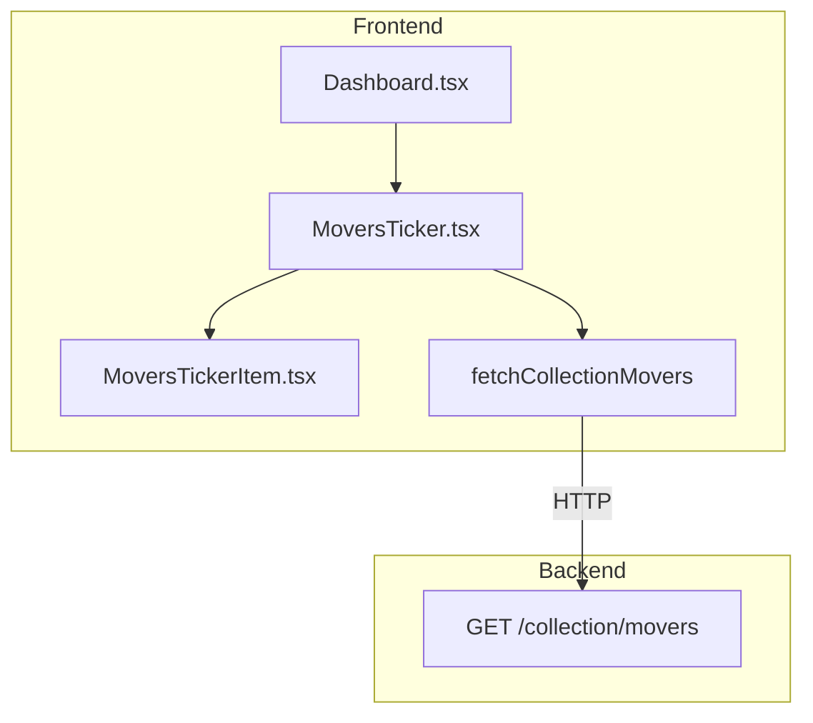
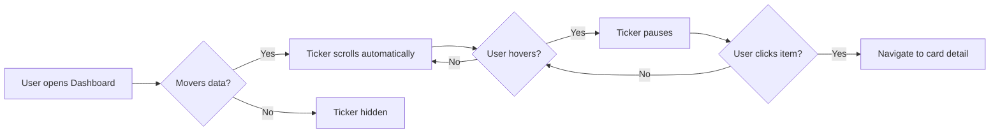

# F184-T03 — Diagrams + i18n Keys

**Wave:** 1
**Type:** docs
**Depends on:** F184-T01
**Status:** done

## User Story

As a developer, I want the feature documented with architecture and journey
diagrams, and all user-facing strings internationalized, so that the codebase
stays maintainable.

## Objective

Create the two mandatory Mermaid diagrams and add any missing i18n keys for
the MoversTicker.

## Dev Notes

- Diagram templates: `docs/diagrams/templates/architecture.mmd` and
  `docs/diagrams/templates/user-journey.mmd`
- i18n files: `frontend/src/locales/en.json` and `frontend/src/locales/pt-BR.json`
- Key to add: `movers.tickerAriaLabel` — e.g. "Collection price movers ticker"
  / "Ticker de variacao de precos da colecao"

## Implementation Details

### New: `docs/diagrams/F184-architecture.mmd`

### New: `docs/diagrams/F184-journey.mmd`

### Edit: locale files

Add `movers.tickerAriaLabel` to both `en.json` and `pt-BR.json`.

## Acceptance Criteria

- [ ] `docs/diagrams/F184-architecture.mmd` exists and renders valid Mermaid
- [ ] `docs/diagrams/F184-journey.mmd` exists and renders valid Mermaid
- [ ] `movers.tickerAriaLabel` key present in both locale files

## Testing

- Validate Mermaid syntax (no parse errors)
- Verify i18n keys exist in both locales via grep

## Test Scenarios

1. **Mermaid valid**: both .mmd files parse without error
2. **i18n complete**: key exists in en.json and pt-BR.json

## Diagrams

- Owns: `docs/diagrams/F184-journey.mmd`
